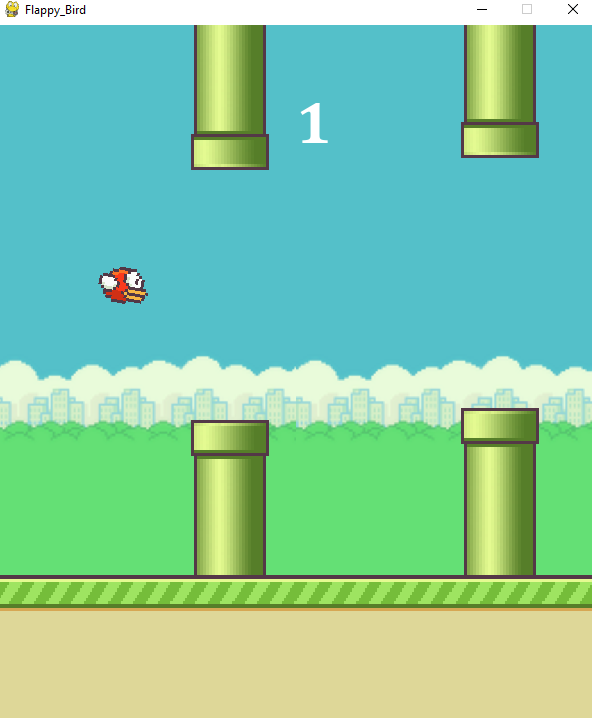
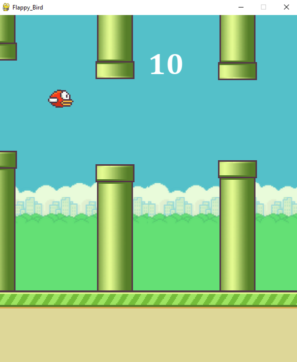
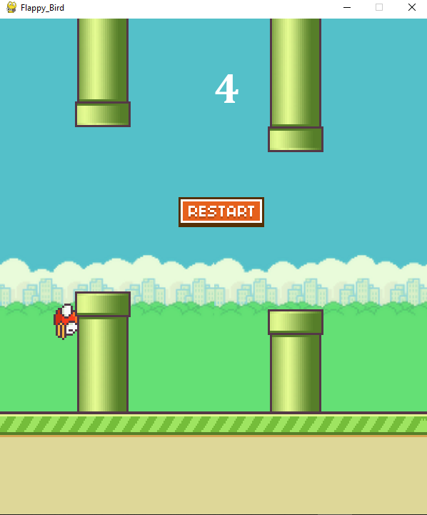

# Flappy Bird



## Description

Il s'agit d'une mise en œuvre simple du classique jeu Flappy Bird en utilisant la bibliothèque Pygame en Python. Le jeu présente un oiseau que le joueur peut contrôler pour naviguer à travers des tuyaux en cliquant sur le bouton de la souris.

## Captures d'écran



## Caractéristiques

- Contrôle réactif de l'oiseau avec des clics de souris.
- Obstacles de tuyaux générés de manière aléatoire.
- Suivi et affichage du score.
- Écran de fin de jeu avec un bouton de redémarrage.

## Comment jouer

1. Exécutez le script Python en utilisant un interpréteur Python avec Pygame installé.
   ```bash
   python main.py
2. Cliquez sur le bouton de la souris pour faire voler l'oiseau et naviguer à travers les tuyaux.

3. Essayez de passer à travers autant de tuyaux que possible pour augmenter votre score.

4. Si l'oiseau entre en collision avec un tuyau ou atteint le sol, le jeu se termine.

5.  sur le bouton "Restart" pour rejouer.


## Dépendances
- Python 3.x
- Bibliothèque Pygame

## Installation
    pip install pygame

## Contrôles
Clique gauche de la souris : Faites voler l'oiseau.
